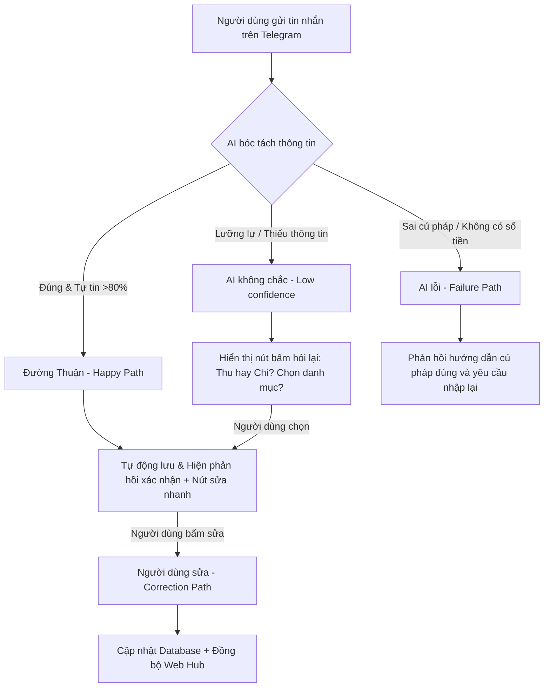

# BẢN ĐẶC TẢ SẢN PHẨM (PRODUCT SPECIFICATION)
## Dự án: Trợ lý Ghi chép Tài chính Thông minh qua Telegram (Moni Bot & Web Hub)
**Nhóm thực hiện:** Nhóm 5 anh em  
**Track:** Personal Finance Management (PFM)  
**Sản phẩm cải tiến dựa trên:** Tính năng Trợ thủ tài chính Moni của MoMo  

---

## 1. Bằng chứng (Evidence)

Nỗi đau (pain point) và các nhận định thiết kế sản phẩm của nhóm được xây dựng dựa trên các bằng chứng quan sát thực tế sau:

### Trải nghiệm trực tiếp (Self-use)
Cả 5 thành viên trong nhóm đã tự trải nghiệm ghi chép chi tiêu bằng các ứng dụng phổ biến như **Money Lover** và **Momo** . Chúng tôi phát hiện ra các điểm gãy lớn về trải nghiệm (UX friction):
* **Quá nhiều bước thao tác:** Để nhập một khoản chi tiêu đơn giản (ví dụ: ăn trưa 35k), người dùng phải thực hiện 5–6 bước: Mở điện thoại ➡️ Tìm app ➡️ Bấm nút thêm mới ➡️ Gõ số tiền ➡️ Chọn danh mục (Ăn uống) ➡️ Nhập ghi chú ➡️ Chọn ví/tài khoản ➡️ Bấm Lưu. Quy trình này tốn từ 15–30 giây.
* **Sự gián đoạn hành vi:** Khi đang thanh toán ở quầy hoặc đi chợ xách đồ cồng kềnh, việc mở ứng dụng tài chính để nhập liệu là bất khả thi. Người dùng thường chọn giải pháp "lát nữa rảnh sẽ nhập", nhưng cuối ngày hoặc cuối tuần họ sẽ quên từ 40% đến 60% các giao dịch nhỏ lẻ, dẫn đến việc quản lý tài chính bị thất thoát.
* **Sự tiện lợi của chat:** Thử nghiệm việc lưu thông tin bằng cách nhắn tin nhanh vào Telegram cho thấy tốc độ nhập liệu cực kỳ nhanh (dưới 3 giây) và không làm gián đoạn dòng công việc hiện tại.

### Nguồn bằng chứng từ bên ngoài nhóm
* **Khảo sát hành vi mạng xã hội:** Trên các cộng đồng tài chính cá nhân và diễn đàn công nghệ, rất nhiều người dùng chia sẻ thói quen kỳ lạ nhưng phổ biến: *Nhắn tin số tiền vừa tiêu vào các tài khoản phụ (clone) của mình trên Facebook Messenger, Zalo, hoặc thậm chí gửi tin nhắn Direct Message cho các tài khoản Idol/người nổi tiếng* chỉ để lưu nhanh con số đó lại vì app nhắn tin luôn được mở sẵn trên màn hình nền điện thoại. Cuối tuần họ mới mở ra để tự tổng hợp lại bằng tay vào Excel. Điều này cho thấy nhu cầu rất lớn về một cổng nhập liệu (input entry point) dạng chat đơn giản, không có rào cản.
* **Phỏng vấn người dùng thật (Anh Du, sinh viên ):**
  > *"Anh Du đi chợ truyền thống mua rau, mua thịt, cá liên tục. Mỗi món chỉ 20k, 30k, 50k. Trả tiền mặt lẻ hoặc quét mã VietQR cá nhân của tiểu thương. Lúc đó tay xách nách mang đồ ăn, không thể nào mở app MoMo hay app ngân hàng để nhập từng dòng được. Anh chỉ nhớ mang máng, đến tối về mệt là quên sạch. Cuối tháng không biết tiền đi đâu hết."*
* **Lịch sử giao dịch VietQR cá nhân thiếu chi tiết:** Khi quét mã VietQR của tiểu thương ở chợ (không phải mã QR MoMo Merchant chính thức của cửa hàng tiện lợi), lịch sử giao dịch ngân hàng chỉ ghi nhận dòng chữ chung chung như `Nguoi nhan: NGUYEN VAN A - So tien: 120,000 VND`. Giao dịch này hoàn toàn không cho biết chi tiết chị Hoa mua những gì (ví dụ: 80k tiền cá và 40k tiền rau). Tính năng tự động phân loại của các app ngân hàng sẽ xếp giao dịch này vào nhóm "Chuyển khoản chung chung", làm mất đi ý nghĩa phân tích chi tiêu. AI của hệ thống cần bóc tách từ tin nhắn chat tự do của người dùng để lưu đúng chi tiết này.

---

## 2. Lát cắt để build (Build Slice)

Thay vì phát triển một ứng dụng quản lý tài chính đồ sộ với đầy đủ tính năng báo cáo, phân tích và đồng bộ ngân hàng, nhóm tập trung chứng minh ý tưởng cốt lõi thông qua một lát cắt nhỏ nhất (build slice) duy nhất:

> **"Đối với một người dùng cá nhân bận rộn cần ghi chú nhanh khoản tiền ngay sau khi giao dịch, prototype sẽ sử dụng AI trên Telegram Bot để tự động bóc tách số tiền, phân loại danh mục, và xác định bản chất giao dịch (thu hay chi) từ một tin nhắn văn bản tự do của người dùng (VD: 'ăn sáng 35k'), sau đó tự động chuẩn hóa dữ liệu dưới dạng JSON để lưu vào database và hiển thị tức thời lên giao diện Web Hub Dashboard báo cáo tài chính."**

---

## 3. AI Product Canvas

| Ô | Câu hỏi cần trả lời | Giải pháp chi tiết của sản phẩm |
|---|---|---|
| **Value** — Giá trị | Sản phẩm dành cho ai, họ đau ở đâu, và AI giải được điều gì mà cách làm hiện tại chưa giải tốt? | **Dành cho:** Người dùng cá nhân, nội trợ, tiểu thương, hoặc lao động tự do giao dịch nhỏ lẻ hàng ngày bằng tiền mặt hoặc VietQR cá nhân. **Nỗi đau:** Friction lớn từ form nhập liệu nhiều bước khiến họ lười ghi chép dẫn đến thất thoát tiền bạc. **AI giải quyết:** Tự động hóa việc bóc tách thông tin giao dịch (Số tiền, Loại, Nhãn, Thời gian) và tự động phân loại danh mục (Ăn uống, Di chuyển, Mua sắm,...) từ tin nhắn văn bản chat tự do thông thường. Người dùng chỉ cần nhắn tin như chat với bạn bè, hệ thống tự động làm phần việc nặng phía sau. |
| **Trust** — Niềm tin | Khi AI trả lời sai, người dùng nhận ra bằng cách nào, và họ sửa lại, hoàn tác hay chuyển sang người thật ra sao? | **Cách nhận ra:** Ngay sau khi xử lý tin nhắn, Bot sẽ phản hồi một tin nhắn xác nhận định dạng rõ ràng (Số tiền, Loại, Danh mục) kèm theo các nút bấm tương tác nhanh dạng Inline Keyboard. **Cách sửa/hoàn tác:** Người dùng có thể bấm nút `[Hoàn tác ↩️]` để xóa giao dịch ngay lập tức, bấm nút `[Đổi danh mục 📁]` để chọn danh mục khác qua menu nút bấm, hoặc sửa trực tiếp trên giao diện Web Hub Dashboard. |
| **Feasibility** — Tính khả thi | Có đáng để build không? Hãy cân nhắc chi phí mỗi lượt gọi, độ trễ, dữ liệu cần có, rủi ro lớn nhất, và ngưỡng mà nhóm sẵn sàng dừng lại. | **Chi phí:** Dùng các mô hình LLM nhẹ. **Độ trễ:** Đảm bảo thời gian phản hồi của Bot dưới 1.5 giây. **Dữ liệu cần:** Tin nhắn text tự do của người dùng chat trên Telegram. **Rủi ro lớn nhất:** AI nhận diện sai lệch số tiền do viết tắt (VD: hiểu nhầm "500" là 500đ thay vì 500k). **Ngưỡng dừng lại:** Khi độ tin cậy trích xuất (confidence score) của mô hình dưới 80% hoặc thiếu số tiền, Bot sẽnhẹnhẹng việc tự động lưu và chuyển sang hỏi lại người dùng để làm rõ thông tin. |
| **Tín hiệu học** | Khi người dùng chỉnh sửa kết quả, dữ liệu đó đi về đâu và giúp sản phẩm khá lên nhờ tín hiệu nào? | **Nguồn dữ liệu:** Khi người dùng bấm nút sửa danh mục, sửa số tiền hoặc hoàn tác trên Telegram/Web Hub, log chỉnh sửa này (gồm text đầu vào gốc ➡️ kết quả AI đoán sai ➡️ kết quả người dùng sửa đúng) được lưu vào DB. **Tác dụng:** Dữ liệu này sẽ được dùng để cải tiến System Prompt của AI thông qua kỹ thuật Few-shot Learning hoặc cập nhật tập dữ liệu kiểm thử (Evaluation Dataset) để cải tiến mô hình cho các phiên bản tiếp theo. |

---

## 4. Tăng năng lực hay tự động hóa (Augmentation vs. Automation)

Nhóm lựa chọn phương thức tiếp cận: **Conditional Automation (Tự động hóa có điều kiện)**.

### Mức độ can thiệp của AI và Con người
* **AI tự động hành động (Automation):** Đối với các tin nhắn có thông tin rõ ràng và AI đạt độ tự tin cao (Confidence > 80%, ví dụ: "chi 50k ăn sáng", "nhận lương 8 triệu"), AI sẽ tự động phân loại danh mục, lưu trữ bản ghi vào database và cập nhật lên Web Hub. Bot phản hồi xác nhận đã lưu thành công kèm theo các nút bấm hỗ trợ sửa nhanh nếu cần.
* **AI chuẩn bị và gợi ý (Augmentation):** Đối với các tin nhắn mơ hồ, thiếu thông tin cốt lõi (ví dụ: "chuyển khoản 500k" - không rõ thu hay chi; hoặc "tiền nhà 2 triệu" - không rõ thanh toán tiền nhà hay nhận tiền nhà), AI sẽ không tự động lưu mà phản hồi bằng câu hỏi xác nhận cùng các tùy chọn nhanh dưới dạng nút bấm (Inline Keyboard) để con người tự chọn và xác nhận.

### Lý do lựa chọn
Quyết định này tối ưu hóa tốc độ ghi chép (0-friction). Với các giao dịch tài chính cá nhân thường ngày, hậu quả của việc AI phân loại sai không quá nghiêm trọng và hoàn toàn có thể đảo ngược/hoàn tác (Undo) dễ dàng, do đó không cần thiết phải bắt người dùng bấm xác nhận ở từng giao dịch rõ ràng. Việc tự động hóa có điều kiện giúp người dùng duy trì thói quen ghi chép lâu dài nhờ sự tiện lợi tối đa.

---

## 5. Bốn đường đi của trải nghiệm (Four Paths)

Chúng tôi thiết kế trải nghiệm người dùng tương thích với 4 tình huống có thể xảy ra khi tương tác với AI:

### Chi tiết 4 đường trải nghiệm:

| Đường đi | Câu hỏi trải nghiệm | Mô tả cách xử lý trong Prototype |
|----------|---------------------|----------------------------------|
| **1. Đường thuận (Happy Path)** | AI đúng và tự tin — người dùng thấy gì? | Người dùng gõ: `"ăn sáng 35k"` Bot nhận diện chính xác: Loại = Chi tiêu, Số tiền = 35.000đ, Danh mục = Ăn uống. Bot phản hồi tin nhắn dạng template đẹp mắt và lưu trực tiếp lên Web Hub: `📝 Đã ghi nhận: Chi - 35,000đ (Ăn uống 🍔)`. Kèm theo 2 nút bấm tương tác dưới tin nhắn: `[Hoàn tác ↩️]` và `[Đổi danh mục 📁]`. |
| **2. Khi AI không chắc (Low confidence)** | AI lưỡng lự — xử lý thế nào? | Người dùng gõ: `"tiền nhà 2 triệu"` AI nhận diện được số tiền nhưng không chắc đây là khoản thu hay chi. Bot phản hồi bằng câu hỏi kèm nút bấm: `🤔 Khoản tiền 2,000,000đ này là khoản Thu hay Chi của bạn vậy?` `[Nút: Chi tiền nhà 🔴] [Nút: Thu tiền nhà 🟢]`. Sau khi người dùng chọn nút, dữ liệu mới được lưu. |
| **3. Khi AI sai (Failure Path)** | Kết quả sai — người dùng gỡ ra thế nào? | Người dùng gõ tin nhắn không có số tiền hoặc sai chính tả quá nặng: `"hôm nay đi chợ mua rất nhiều đồ"` AI không trích xuất được thông tin tài chính. Bot phản hồi nhẹ nhàng bằng hướng dẫn: `⚠️ Mình chưa tìm thấy số tiền trong tin nhắn của bạn. Bạn vui lòng nhắn tin theo cú pháp đơn giản nhé! Ví dụ: 'đi chợ 100k mua cá' hoặc 'ăn trưa 40k'.` |
| **4. Khi người dùng sửa (Correction Path)** | Người dùng chỉnh lại — dữ liệu đi về đâu? | Người dùng gõ: `"mua giáo trình 200k"`. AI tự động phân loại thành danh mục `Mua sắm 🛍️`. Người dùng thấy chưa chính xác nên bấm vào nút `[Đổi danh mục 📁]` hiển thị ngay dưới tin nhắn xác nhận của Bot. Bot hiển thị danh sách các danh mục khác, người dùng chọn `Giáo dục 🎓`. Bot lập tức gọi API cập nhật bản ghi trong DB, báo: `✅ Đã cập nhật danh mục sang Giáo dục` và đồng bộ hiển thị lên Web Hub Dashboard. |

---

## 6. Những kiểu lỗi đáng lo nhất (Critical Failure Modes)

Nhóm xác định 2 kiểu lỗi nguy hiểm nhất cần tập trung xử lý trong prototype:

### Kiểu lỗi 1: Sai lệch đơn vị tiền tệ/Số chữ số 0 (Nghiêm trọng nhất)
* **Khi nào xuất hiện:** Người dùng nhập số viết tắt không theo chuẩn thông thường (VD: gõ `"mua rau 30"` -> ý là 30.000đ nhưng AI hiểu thành 30đ; hoặc gõ `"mua đồ 500"` -> ý là 500k tức 500.000đ nhưng AI hiểu thành 500đ).
* **Ai chịu thiệt & mức độ nặng nhẹ:** Người dùng chịu thiệt cực kỳ nặng. Báo cáo thu chi tổng hợp cuối tháng sẽ bị sai lệch nghiêm trọng (sai lệch gấp 1000 lần), phá hỏng hoàn toàn độ tin cậy của biểu đồ tài chính và gây ức chế lớn cho người dùng.
* **Cách xử lý trong prototype:** 
  1. Trong System Prompt của AI, cấu hình luật mặc định: các số từ 1 đến 999 đi kèm với các từ khóa chi tiêu hàng ngày mà không ghi rõ đơn vị thì tự động nhân với 1.000 (VD: "30" -> 30.000đ).
  2. Tin nhắn phản hồi của Bot luôn ghi rõ số tiền đầy đủ kèm định dạng tiền tệ (VD: `30,000 VNĐ` chứ không ghi `30`).
  3. Đính kèm nút bấm `[Hoàn tác ↩️]` và nút `[Sửa số tiền ✏️]` trực tiếp dưới tin nhắn xác nhận để người dùng bấm hủy hoặc sửa nhanh chỉ trong 1 giây nếu AI bóc tách sai.

### Kiểu lỗi 2: Nhầm lẫn bản chất giao dịch Thu vs. Chi
* **Khi nào xuất hiện:** Khi người dùng nhập các câu có cấu trúc phủ định hoặc mang tính chất hoàn trả phức tạp (VD: `"được hoàn tiền mua áo 200k"`, `"trả nợ Nam 100k"`, `"Nam trả nợ 100k"`). AI rất dễ nhầm lẫn hướng dòng tiền.
* **Ai chịu thiệt & mức độ nặng nhẹ:** Người dùng chịu thiệt ở mức trung bình. Tổng thu và tổng chi bị tính toán ngược, ảnh hưởng đến kế hoạch cân đối ngân sách.
* **Cách xử lý trong prototype:**
  1. Sử dụng kỹ thuật Prompt Engineering với các ví dụ Few-shot phân biệt rõ cấu trúc câu "Nam trả nợ" (Thu nhập) và "trả nợ Nam" (Chi tiêu).
  2. Phản hồi của Bot làm nổi bật loại giao dịch bằng các thẻ màu trực quan (`Chi tiêu 🔴` hoặc `Thu nhập 🟢`).
  3. Cung cấp nút bấm đảo ngược loại giao dịch nhanh `[Chuyển thành Thu 🟢]` hoặc `[Chuyển thành Chi 🔴]` ngay dưới tin nhắn để sửa đổi ngay lập tức.

---

## 7. Kế hoạch kiểm thử và bằng chứng demo (Test Plan)

Để chuẩn bị cho phần demo trực quan trước giảng viên và các nhóm khác, nhóm chuẩn bị sẵn bộ test case kiểm thử sau:

### Kịch bản kiểm thử Demo (Test Cases)

| Kịch bản | Đầu vào (Input) | Kết quả kỳ vọng (Expected Output) | Mục tiêu chứng minh |
|----------|-----------------|-----------------------------------|--------------------|
| **Test Case 1** (Happy Path) | `"ăn cơm sườn 45k"` | - Loại: Chi tiêu 🔴 - Số tiền: 45,000đ - Danh mục: Ăn uống 🍔 - Hiển thị tức thời trên Web Hub Dashboard. | AI bóc tách ngôn ngữ tự nhiên tốt, phân loại đúng, tự động lưu nhanh không cần xác nhận. |
| **Test Case 2** (Low confidence) | `"tiền phòng 2 triệu"` | - AI không chắc chắn thu hay chi. - Bot phản hồi hỏi lại: `"Khoản 2,000,000đ này là Thu nhập hay Chi tiêu?"` kèm nút lựa chọn. | Hệ thống an toàn khi AI không chắc, không tự ý ghi nhận dữ liệu sai lệch. |
| **Test Case 3** (Correction Path) | `"đóng tiền học 1 triệu"` | - AI bóc tách 1,000,000đ. - AI phân loại nhầm danh mục thành "Hóa đơn & Tiện ích". - Người dùng bấm nút `[Đổi danh mục]` chọn `Giáo dục 🎓`. Giao diện Web Hub tự động cập nhật lại danh mục Giáo dục. | Quy trình sửa lỗi đơn giản, đồng bộ dữ liệu tức thời giữa Telegram Bot và Web Hub. |
| **Test Case 4** (Failure Recovery) | `"đổ xăng 50"` | - AI tự động nhân hệ số 1,000 để bóc tách thành 50,000đ. - Bot ghi nhận Chi tiêu - Di chuyển - 50.000 VNĐ. - Hiển thị nút `[Hoàn tác ↩️]` đề phòng trường hợp người dùng thực sự chỉ tiêu 50đ. | AI xử lý thông minh các trường hợp người dùng viết tắt số tiền và cung cấp cơ chế phục hồi nhanh. |

---

## 8. Phân công nhiệm vụ (Assignments)

Nhóm phân chia công việc rõ ràng cho từng thành viên để đảm bảo tính phối hợp và mỗi người có thể tự tin bảo vệ phần việc của mình khi demo:

* **Phạm Triều Dương (AI & Bot Integration):**
  * *Nhiệm vụ:* Thiết lập Telegram Bot, viết mã nguồn xử lý webhook từ Telegram, thiết kế và tối ưu hóa System Prompt cho LLM API (bóc tách thông tin giao dịch thành JSON chuẩn hóa), xử lý logic phản hồi tin nhắn và tương tác qua các nút bấm Inline Keyboard.
  * *Bằng chứng trong repo:* Mã nguồn Bot Telegram và module prompt integration trong folder `codebase/bot-telegram`.
* **Lê Sỹ Hân (Backend Developer):**
  * *Nhiệm vụ:* Thiết kế database schema để lưu trữ danh sách giao dịch, viết API server (Node.js/Python) để nhận dữ liệu JSON chuẩn hóa từ Bot gửi sang, xử lý các tác vụ CRUD (thêm, sửa, xóa, lấy danh sách giao dịch) và cung cấp API cho Web Hub Dashboard.
  * *Bằng chứng trong repo:* Schema database, mã nguồn Backend server và tài liệu API trong folder `codebase/backend`.
* **Nguyễn Thành Đạt (Frontend Developer):**
  * *Nhiệm vụ:* Xây dựng giao diện Web Hub Dashboard hiển thị báo cáo tài chính cá nhân, vẽ các biểu đồ thu chi trực quan bằng chart libraries (như Chart.js hoặc Recharts), danh sách lịch sử giao dịch và form chỉnh sửa/xóa giao dịch trực tiếp trên Web.
  * *Bằng chứng trong repo:* Mã nguồn ứng dụng Web Frontend trong folder `codebase/frontend`.
* **Nguyễn Viết Du (Integration & QA Tester):**
  * *Nhiệm vụ:* Thực hiện cấu hình và chạy thử kết nối Webhook end-to-end giữa Bot Telegram và Backend server, kiểm thử các kịch bản lỗi, đo lường độ trễ của Bot, thực hiện quay video màn hình chạy thử các kịch bản demo làm phương án dự phòng (backup).
  * *Bằng chứng trong repo:* File tài liệu testcases, nhật ký logs kiểm thử và video demo lưu trong folder `spec/demo-assets/`.
* **Nguyễn Ngọc Duy (Product Owner & Documentation):**
  * *Nhiệm vụ:* Nghiên cứu hành vi người dùng, thu thập bằng chứng thực tế, viết và hoàn thiện tài liệu SPEC sản phẩm (`spec/spec.md`), chuẩn bị slide demo thuyết trình .
  * *Bằng chứng trong repo:* Bản đặc tả sản phẩm hoàn chỉnh `spec/spec.md` và slide thuyết trình `spec/demo-slides.pdf` (nếu có).
